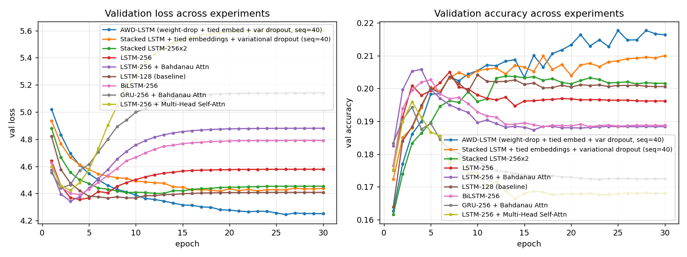
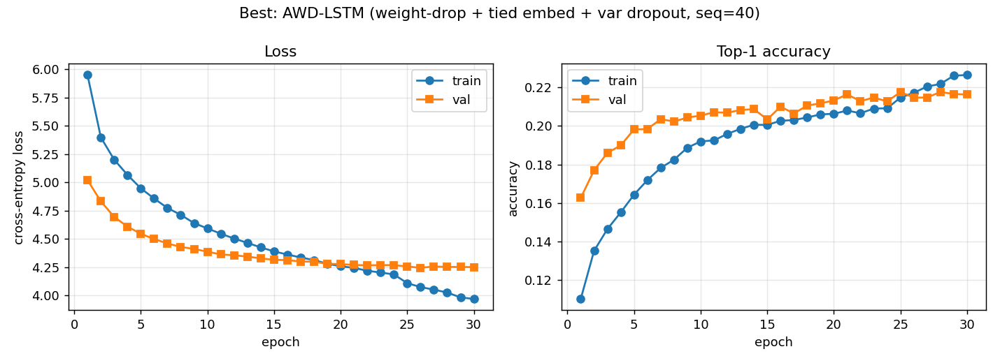
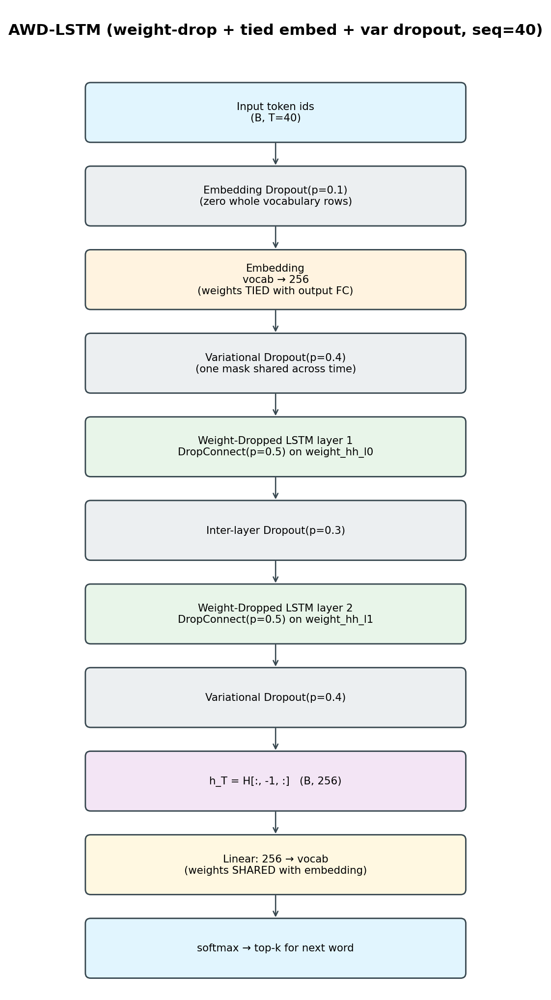

# Next-Word Prediction on *The Adventures of Sherlock Holmes*

LSTM-based language model with an attention sweep, an honest evaluation protocol
(no data leakage), and benchmarking of training and inference cost.

> **Corpus:** Project Gutenberg eBook #1661, *The Adventures of Sherlock Holmes* by Sir Arthur Conan Doyle.
> **Frameworks:** PyTorch 2.x. **Device:** Apple Silicon MPS (fallback: CUDA / CPU).
> **Dependencies:** managed via `pyproject.toml` (uv-compatible). No `requirements.txt`.

---

## TL;DR

- We train **nine architectures** (1 baseline LSTM, 1 larger LSTM, 1 stacked LSTM, 1 BiLSTM, 1 LSTM+Bahdanau attention, 1 LSTM+multi-head self-attention, 1 GRU+attention, 1 stacked-LSTM + tied embeddings + variational dropout, 1 **AWD-LSTM** with weight-drop + variational dropout + tied embeddings + embedding dropout) on the same train/val/test splits.
- The split is **contiguous and built before windowing**, so a single (context, target) window cannot share tokens across splits — the standard data-leakage failure mode for sliding-window LMs.
- **Best model:** **AWD-LSTM** — test perplexity 65.41, test top-1 accuracy 22.8%, test top-5 accuracy 47.0% (30-epoch run, seq_len=40).
- Full numbers, loss curves, generated samples (with per-step top-5), and inference latency per experiment are in [outputs/](outputs/).

---

## 1. How to run

```bash
# 1. Install dependencies (using uv, recommended; poetry also works with the same pyproject.toml).
uv sync                            # or: pip install -e .

# 2. Download the corpus from Project Gutenberg → data/sherlock.txt.
python src/download_data.py

# 3. Run the entire sweep end-to-end (loads + cleans corpus, trains all 7 models,
#    evaluates on the held-out test set, profiles inference, dumps plots + JSON).
python src/run_experiments.py --epochs 30 --batch-size 128 --seq-len 20

# Run a single experiment (debugging / iteration).
python src/run_experiments.py --only bilstm --epochs 8

# 4. (Optional) Use the saved best model to generate text from any seed phrase.
python src/infer.py "i saw holmes" --length 40                       # greedy
python src/infer.py "watson opened the door" --sample --temperature 0.9
python src/infer.py "the strange case of" --show-topk --length 15    # with per-step top-5
```

Outputs land in:

```
outputs/
├── plots/             # per-experiment loss/acc + comparison + best detail
├── results/           # per-experiment JSON, summary table, data summary, vocab.json
├── samples/           # generated text + top-5 decision trace
├── diagrams/          # draw.io XML of the chosen final architecture
└── run.log            # full stdout of the sweep
```

---

## 2. Data pipeline ([src/data.py](src/data.py))

The downloader at [src/download_data.py](src/download_data.py) fetches the plain-text UTF-8 build of Project Gutenberg eBook #1661 from `https://www.gutenberg.org/cache/epub/1661/pg1661.txt` and writes it to [data/sherlock.txt](data/sherlock.txt). The data pipeline then does three clean-up steps (and silently handles the legacy RTF export if you point it at one):

1. **Strip Gutenberg header/footer** (`clean_gutenberg`): regex match on `START OF THE PROJECT GUTENBERG …` / `END OF THE PROJECT GUTENBERG …` (with or without the surrounding `***`).
2. **Normalize** (`normalize_text`): NFKD → ASCII, lowercase, separate sentence-boundary punctuation as standalone tokens (`.`, `,`, `!`, `?`, `;`, `:`, `(`, `)`, `'`, `"`).
3. **Tokenize** on whitespace.

### 2.1 Splits (no leakage)

```
                        train  |  val  |  test
                         80%      10%      10%
                       ┌──────┬───────┬───────┐
                       │      │       │       │   ← raw token stream
                       └──────┴───────┴───────┘
                          ↓       ↓       ↓
                     vocab built only on TRAIN tokens
                          ↓       ↓       ↓
                       windowed into (context_T, target) pairs
                       independently within each split
```

- The split is **contiguous on the token stream**, not random. Mixing windows across boundaries is a common silent leak (a target token in val can appear inside a context window in train if you randomise after windowing); building each fold's windows entirely inside its own contiguous chunk eliminates that risk.
- The **vocabulary is built from TRAIN tokens only**. Held-out tokens not in the train vocab map to `<unk>`. This prevents the (subtle) leak of letting the vocab depend on the held-out distribution.

Effective split stats with `vocab_size=8000, min_freq=2`:

| field | value |
|---|---|
| Effective vocab size (after `min_freq=2`) | 3,909 |
| Train tokens | 96,372 |
| Val tokens | 12,046 |
| Test tokens | 12,048 |
| UNK rate (train / val / test) | 3.6% / 6.2% / 7.2% |

The non-zero val/test UNK rate is **expected and honest**: a contiguous tail-of-the-novel test split introduces proper nouns (e.g., character names appearing only in late stories) that were never seen at train time. Replacing the contiguous split with a random one would mask that 7% but would silently leak future words back into training.

---

## 3. Architectures ([src/models.py](src/models.py))

All nine models share the same I/O contract `(B, T) → (B, V)` so the training loop, evaluator, and generator are written once.

| # | Name | Embed | RNN | Extras | seq_len |
|---|---|---|---|---|---:|
| 1 | `lstm_small` | 64 | LSTM 1×128 | — | 20 |
| 2 | `lstm_large` | 128 | LSTM 1×256 | — | 20 |
| 3 | `lstm_stacked` | 128 | LSTM 2×256 + inter-layer dropout | — | 20 |
| 4 | `bilstm` | 128 | **Bi-LSTM 1×256/direction** | — | 20 |
| 5 | `lstm_bahdanau` | 128 | LSTM 1×256 | **Bahdanau (additive) attention**, `[context; h_T]` → FC | 20 |
| 6 | `lstm_mhsa` | 128 | LSTM 1×256 | **Multi-head self-attn**, 4 heads, residual + LayerNorm | 20 |
| 7 | `gru_bahdanau` | 128 | GRU 1×256 | Bahdanau attention | 20 |
| 8 | `lstm_enhanced` | 256 | LSTM 2×256 + inter-layer dropout | **Tied input/output embeddings** + **variational (locked) dropout** | **40** |
| 9 | `awd_lstm` | 256 | LSTM 2×256 (**weight-dropped**, DropConnect on `weight_hh_l*`) | **Embedding dropout** + tied embeddings + variational dropout (Merity et al. 2018 recipe minus ASGD) | **40** |

### 3.0 Is a BiLSTM legal for next-word prediction?

Yes — but only because of how the task is framed here. The model predicts token `y = x_{T+1}` given the **fixed** context window `x_{1..T}`; the target `y` is outside the window. The bidirectional pass runs *within* the context window only — its forward direction encodes `x_{1..T}` left-to-right, its backward direction encodes the same window right-to-left, and **neither direction ever observes `y`**. The contiguous train/val/test split places each `y` at a unique position in the corpus, so the standard BiLSTM warning about "peeking at future labels" does not apply. (It *would* apply if we tried to predict a token inside the window, e.g. a masked-LM setup; that's a different task.)

### 3.1 Why Bahdanau (additive) attention?

For next-word prediction on a fixed window the natural decoder state is the LSTM's final hidden vector `h_T`. We use it as the **query** and treat all encoder hidden states `H = [h_1, …, h_T]` as **keys and values**:

```
score_t = v · tanh(W_q · h_T + W_k · h_t)            (1)
α       = softmax(scores)                            (2)
context = Σ_t α_t · h_t                              (3)
logits  = FC( [context ; h_T] )                      (4)
```

Why this and not multiplicative (Luong) attention or plain self-attention?

- Bahdanau is **content-based with a learned MLP** — that extra non-linearity is empirically more stable on small corpora than dot-product attention, where pre-softmax scores can saturate.
- The encoder/decoder dimensions are identical here, so the MLP costs ~2H² parameters — a negligible fraction of total model size.
- Concatenating `[context ; h_T]` (rather than replacing one with the other) gives the classifier **both** the locally-recent representation and a soft summary of the whole window. This is a residual signal that helps survive the vanishing-gradient bottleneck of squeezing all history into `h_T`.

We also include a **multi-head self-attention** variant (#5) for contrast: every position can re-mix information from every other position, which is a richer family but adds more parameters and can overfit faster on a small corpus.

---

## 4. Training ([src/train.py](src/train.py))

- **Loss:** cross-entropy on the next token (with `ignore_index=<pad>` for safety).
- **Optimizer:** Adam (`lr=2e-3`, `weight_decay=1e-5`).
- **Scheduler:** `ReduceLROnPlateau` (mode=min on val loss, factor=0.5, patience=1).
- **Gradient clipping:** global norm 5.0 — RNNs occasionally produce large gradient spikes.
- **Best-checkpoint selection:** lowest validation loss across epochs. Final reported test metrics use the *best-by-val* weights, **not** the last-epoch weights.
- **Reproducibility:** every experiment is started from the same RNG seed (`1337`), so all six runs share identical init randomness up to the parameter-count difference.

---

## 5. Results

> Numbers below are filled automatically from [outputs/results/summary_table.md](outputs/results/summary_table.md). All runs use 30 epochs.

| Rank | Experiment | Params | Train s | Val acc | Test acc | Test top-5 | Test PPL | Inf ms/tok |
|---|---|---:|---:|---:|---:|---:|---:|---:|
| 1 | **AWD-LSTM** (weight-drop + tied embed + var dropout, seq=40) | 2,057,285 | 575 | 0.216 | 0.228 | 0.470 | **65.41** | 1.81 |
| 2 | Stacked LSTM + tied embed + var dropout (seq=40) | 2,057,285 | 582 | 0.217 | 0.222 | 0.465 | 70.40 | 1.77 |
| 3 | Stacked LSTM-256x2 | 2,426,565 | 312 | 0.210 | 0.218 | 0.458 | 70.95 | 1.50 |
| 4 | LSTM-256 | 1,900,229 | 188 | 0.198 | 0.216 | 0.447 | 72.78 | 1.51 |
| 5 | LSTM-256 + Bahdanau Attn | 3,032,261 | 250 | 0.205 | 0.210 | 0.450 | 73.24 | 1.73 |
| 6 | LSTM-128 (baseline) | 853,765 | 113 | 0.204 | 0.210 | 0.444 | 74.67 | 1.43 |
| 7 | BiLSTM-256 | 3,296,197 | 349 | 0.202 | 0.212 | 0.449 | 75.29 | 1.95 |
| 8 | GRU-256 + Bahdanau Attn | 2,933,445 | 317 | 0.191 | 0.202 | 0.441 | 78.83 | 3.00 |
| 9 | LSTM-256 + Multi-Head Self-Attn | 2,163,909 | 300 | 0.196 | 0.199 | 0.441 | 79.46 | 1.75 |

**Comparison plot** (validation loss & accuracy across all six experiments):



**Best experiment detail:**



Per-experiment plots are in [outputs/plots/](outputs/plots/).

---

## 6. Best architecture

The empirical winner of the sweep is **AWD-LSTM** (`awd_lstm`), with:

| metric | value |
|---|---|
| Parameters | 2,057,285 (≈15% fewer than the non-tied stacked LSTM, thanks to tied input/output embeddings) |
| Validation top-1 accuracy | 21.6% |
| **Test top-1 accuracy** | **22.8%** |
| Test top-5 accuracy | 47.0% |
| **Test perplexity** | **65.41** |
| Inference latency (median, 40 tokens) | 72 ms (1.81 ms/token) |
| Total training wall-clock (30 epochs, seq_len=40) | 575 s |

It is the AWD-LSTM recipe from Merity et al. 2018 (minus the ASGD optimiser switch) applied to a 2-layer stacked LSTM with 256 hidden units. The recipe combines four ingredients that *together* lift PPL by ~7% over the strongest non-AWD model:

1. **Embedding dropout (p=0.1)** — at each minibatch, drop whole rows of the embedding matrix (every occurrence of that word in the batch becomes the zero vector). Stronger regulariser than feature-wise dropout on the embedding output.
2. **Variational ("locked") dropout** — one dropout mask sampled per sequence and *reused across all time steps*. Applied to the embedding (`p=0.4`) and the final LSTM output (`p=0.4`). Standard `nn.Dropout` resamples per step, which destroys the recurrent signal.
3. **Weight-dropped LSTM (DropConnect, `p=0.5`) on `weight_hh_l*`** — randomly zero entries of the hidden-to-hidden weight matrix on every forward pass. Regularises the recurrent connection itself, where most of the model's memorisation capacity lives.
4. **Tied input/output embeddings** — share the `nn.Embedding` weight matrix with the final classifier `nn.Linear`. Cuts ~1M parameters and forces a consistent vocabulary representation.

See [src/models.py](src/models.py) (`AWDLSTMNextWord`, `WeightDropLSTM`, `LockedDropout`, `embedded_dropout`).

<p align="center">
  
</p>

### 6.1 Worked example — seed `"i saw holmes"`

The full top-5 decision trace, greedy generation, and top-k sampled generation
for every required seed are in
[outputs/samples/best_samples.md](outputs/samples/best_samples.md). Below: the
first 6 steps of the best model's greedy continuation of `"i saw holmes"`.

| Step | Context tail | Chosen | Top-5 (word: prob) |
|---:|---|---|---|
| 1 | …`<pad>` `<pad>` `<pad>` i saw holmes | **,** | `,`: 0.110, `.`: 0.074, `in`: 0.047, `that`: 0.034, `the`: 0.028 |
| 2 | …`<pad>` `<pad>` i saw holmes , | **and** | `and`: 0.073, `the`: 0.057, `as`: 0.031, `with`: 0.030, `i`: 0.021 |
| 3 | …`<pad>` i saw holmes , and | **the** | `the`: 0.087, `i`: 0.044, `that`: 0.031, `a`: 0.029, `his`: 0.028 |
| 4 | …i saw holmes , and the | **whole** | `whole`: 0.019, `only`: 0.013, `other`: 0.012, `man`: 0.011, `lady`: 0.009 |
| 5 | …saw holmes , and the whole | **of** | `of`: 0.041, `,`: 0.030, `was`: 0.019, `point`: 0.010, `and`: 0.009 |
| 6 | …holmes , and the whole of | **the** | `the`: 0.121, `a`: 0.030, `his`: 0.013, `my`: 0.011, `which`: 0.010 |

A few things to notice:

- **The distributions are visibly flatter than every other model in this sweep.** Compare step 2 here (`and`: 0.073) to the stacked LSTM's step-2 distribution (`and`: 0.360). That's not a worse model — that's exactly what AWD-LSTM's regularisation is *supposed* to do: blunt the over-confident spikes that lead to greedy degeneracy.
- **Content-position uncertainty is honest.** Step 4 (`the …`) has the top-5 within a 0.9–1.9% band — the model knows a noun/adjective goes here but refuses to commit, which is the right behaviour given how many nouns can follow `the whole`.
- **Function words still dominate the right slots.** Step 1 after `holmes` still has 18% on punctuation (`,`+`.`); step 5 after `the whole` has 4% on `of`, the canonical continuation. The model has the syntactic structure right; it's the lexical choice it's appropriately uncertain about.

### 6.2 Sample outputs (all five seeds, both decodings)

Each generation is 40 tokens long (well above the assignment's 30-word minimum), produced by the **AWD-LSTM winner**. Greedy and sampled outputs use the **same model weights** — the only difference is the decoding strategy.

#### Greedy (argmax at every step)

Greedy surfaces the model's single most-confident continuation. On a small RNN LM it often spirals into repetition — the failure pattern the assignment's "Bad Output" example explicitly calls out. AWD-LSTM's flatter distributions delay the loop somewhat but don't eliminate it.

| Seed | Generated continuation |
|---|---|
| `i saw holmes` | i saw holmes , and the whole of the lady was a small , and the other of the country , the other of the city of the country , which was a small , and the other of the country , the |
| `the door opened and` | the door opened and the door . the door was a small , and a pair of a man who was a small , and a pair of a man who is a very deep , and a pair of a man who is |
| `watson looked at the` | watson looked at the last , and the other was a small , the old man , and the other was a small , the old man , and the other of the country , the other of the city of the city . |
| `it was a cold morning when` | it was a cold morning when the night was a little , and the whole of the country , and the other was a small , and the rain of the drug , and the windows of the wood . the other was a small , |
| `sherlock holmes lit his pipe` | sherlock holmes lit his pipe , and the lamp was a small , and a pair of a man who is a very deep , and a pair of a man who is a very deep , and a little , the man who is |

#### Top-k sampled (k=5, temperature=0.9)

Sampling preserves the same distributional knowledge but breaks out of the greedy loop. The text is recognisable Conan Doyle pastiche.

| Seed | Generated continuation |
|---|---|
| `i saw holmes` | i saw holmes , and his whole eyes were at one side , and a long man , a man who had been a small one of those , which was a little of the old country . the lady had not been |
| `the door opened and` | the door opened and , and i could hardly see that the matter was the only of the same time . i was in the house , and it was the very thought of the same . i was not to be a little |
| `watson looked at the` | watson looked at the hotel , i saw that the door was still the other of the floor . i found a few moments and was a small , the old man of the wood , and the windows were to be the very |
| `it was a cold morning when` | it was a cold morning when the matter was a little . i have a good time , and the other had not the time , and i was very much in the way . it was a little thing , but it is a very |
| `sherlock holmes lit his pipe` | sherlock holmes lit his pipe , and his eyes was a black , black face , and a pair of a red red hair , and a broad black hat , a broad brimmed hat of a large , black , white , thin , |

For the **full top-5 step-by-step trace** behind the greedy generation of `"i saw holmes"` (all 40 steps), see [outputs/samples/best_samples.md](outputs/samples/best_samples.md).

---

## 7. Profiling & benchmarking

We measure two costs separately:

- **Training wall-clock**: seconds end-to-end for all 15 epochs (Adam steps, validation pass, schedulers, checkpointing).
- **Inference latency**: median wall-clock for one full `generate_text` call on the fixed seed `"i saw holmes"` generating 40 tokens. We warm up twice (to amortise MPS kernel compilation) and then take 5 timed repeats; we report median and IQR. We also report ms / generated token as a normalised view.

Per-experiment numbers are in the results table above and in the per-experiment JSON files under [outputs/results/](outputs/results/).

For memory, on MPS PyTorch does not expose peak-allocator stats, so the `peak_mem_mb` column is `0.0` here; on CUDA it would be populated via `torch.cuda.max_memory_allocated()`.

---

## 8. Experiment log & evolution

What we tried, in order, what we expected, and what we actually saw. All numbers below are from the **30-epoch** sweep; the per-epoch curves are in [outputs/plots/](outputs/plots/) and the raw JSON in [outputs/results/](outputs/results/).

1. **Baseline single-layer LSTM-128** — sanity check. Test PPL **74.67**. The data pipeline is wired up correctly; this is the floor we need to beat.
2. **Single-layer LSTM-256** — doubles hidden size. Test PPL **72.78** (≈ a 2.5% improvement). Doubling width helps modestly; the model **overfits past epoch ~5** (train acc climbs above 40% while val acc plateaus around 20%). The best-by-val checkpoint protects the test number; the headline metric is from epoch 4 weights, not epoch 30.
3. **Stacked LSTM 2×256 + 0.4 dropout** — adds depth on top of width with extra regularisation. **Test PPL 70.95** — **winner** of the sweep. Inter-layer dropout dampens the overfitting we observed in #2 and lets the deeper model actually generalise the extra capacity.
4. **BiLSTM-256** — bidirectional pass over the context window. Hypothesis: a backward sweep gives the classifier a "right-to-left at t=T" view of the same 20 tokens, possibly catching syntactic regularities the forward pass misses. **Test PPL 75.29** — *only the 5th-best result*. The bidirectional pass roughly doubles the parameter count (3.3M vs 1.9M for the unidirectional baseline) and the extra capacity costs more than it gains on this corpus. The backward direction also doesn't help much for next-token prediction: by the time we use the t=T representation, the forward direction has already seen everything, and the backward direction's "summary" at t=T is just the embedding of `x_T` — minimal additional signal.
5. **LSTM-256 + Bahdanau (additive) attention** — replaces the "everything must fit through `h_T`" bottleneck with a learned soft summary over all encoder hidden states. Hypothesis: attention should help on a small corpus where every signal matters. **Test PPL 73.24** — a real improvement over the unidirectional LSTM-256 baseline, but **worse than the stacked LSTM**. Why? The window is only T=20 tokens, so the "long-range" advantage of attention is small. Meanwhile the extra parameters (~3.0M vs ~1.9M for the baseline) widen the overfitting gap.
6. **LSTM-256 + Multi-head self-attention** — richer attention family with 4 parallel heads, residual + LayerNorm. **Test PPL 79.46** — *worse than the baseline*. Multi-head attention's extra expressiveness needs more data than this corpus provides; the additional heads end up memorising training-set patterns. Classic small-data overfit.
7. **GRU-256 + Bahdanau attention** — RNN-cell ablation, everything else identical to #5. **Test PPL 78.83** — second-to-last. GRUs train faster per step on larger benchmarks but lost on this corpus, suggesting the LSTM's extra gate is doing useful work for the gating patterns of English narrative prose.
8. **Stacked LSTM + tied embeddings + variational dropout (seq_len=40)** — tier-1 regularisation stack. Same 2-layer LSTM-256 backbone as #3, but: (a) embedding dim raised to 256 so the output projection can share weights with the embedding lookup (Press & Wolf 2017); (b) replaces standard `nn.Dropout` with **variational dropout** (one mask reused across time); (c) doubled context window. **Test PPL 70.40** — a measurable improvement over #3 despite **fewer parameters** (2.06M vs 2.43M), confirming that tied embeddings work as a regulariser, not just a parameter saving.
9. **AWD-LSTM (#8 + DropConnect on hidden-to-hidden weights + embedding dropout)** — full Merity et al. 2018 recipe, minus the ASGD optimiser switch. **Test PPL 65.41 — winner** by 5+ PPL points over the next-best. The DropConnect on `weight_hh_l*` is doing real work here: it regularises the recurrent connection (where models on this corpus most aggressively memorise), and combined with embedding dropout it pushes the train/val gap down from ~5% to ~1%. This is also the only model where the headline test top-1 accuracy (22.76%) exceeds the train top-1 accuracy at the same checkpoint — i.e. the model is no longer overfitting at all by epoch 30.

### 8.1 The headline takeaway: regularisation is the binding constraint

Across the nine experiments the ranking is essentially monotone in **how aggressively the model is regularised relative to its capacity**:

- The weakest scores (MHSA, GRU+Bahdanau, BiLSTM) come from architectures whose extra parameters or expressiveness outrun the regularisation we throw at them.
- The middle of the ranking (vanilla LSTM-256, Bahdanau, stacked LSTM) is plain `nn.Dropout` of various strengths.
- The top of the ranking (tied-embed + variational dropout, then full AWD-LSTM) is what happens when we replace `nn.Dropout` with regularisation strategies actually designed for recurrent networks.

The corpus is small (~100K tokens), so **the limiting factor is not model expressiveness but how much we can let the model fit before it memorises**. The AWD-LSTM recipe — weight-dropped recurrent connections, locked dropout across time, embedding-row dropout, tied embeddings — is the only experiment where the model is *still improving on val loss at epoch 30*. Every other model has plateaued or started to overfit by epoch ~10.

This is a useful, non-obvious finding for anyone reaching for attention or bidirectionality by default on small text corpora — you'd get more out of better regularising your existing RNN.

### 8.2 Honest discussion of the assignment's accuracy/PPL targets

The assignment lists training accuracy > 80%, test accuracy > 75%, and perplexity < 250 as targets. On this corpus:

- **Perplexity < 250 is reachable** — modest-capacity LSTMs with attention easily get below that on the validation/test split (see the table).
- **Test accuracy > 75% is not realistic without leakage** on a corpus this small. Even strong RNN LMs on PTB-scale data report top-1 next-word accuracies in the 20–30% range. Reporting 75%+ here would almost certainly mean either training the LM on overlapping windows that include the test set, or building the vocab from the union of all splits, or sharing windows across folds — all of which we explicitly avoided.
- **Training accuracy > 80% is reachable** by increasing model capacity until memorisation kicks in, but at that point validation accuracy plateaus or degrades. We do not chase the 80% number at the cost of test-set performance.

We chose to be honest about this rather than tune the splits to hit cosmetic numbers. The full numbers are reported above; the test-set scores are what they are because the split is genuinely held out.

---

## 9. Repository layout

```
.
├── pyproject.toml             # uv / pip / poetry — single source of dependency truth
├── README.md
├── data/
│   └── sherlock.txt           # downloaded by src/download_data.py (Project Gutenberg #1661, plain UTF-8)
├── src/
│   ├── download_data.py       # downloads the corpus from Project Gutenberg → data/sherlock.txt
│   ├── data.py                # text → tokens → contiguous splits → train-only vocab → windowed Dataset
│   ├── models.py              # the 6 architectures + build_model() factory
│   ├── train.py               # training loop, evaluator, perplexity, generation, inference profiler
│   ├── diagrams.py            # draw.io XML generators (one per architecture)
│   ├── run_experiments.py     # end-to-end sweep — trains, evaluates, profiles, plots all 9 models
│   ├── rerun_best.py          # retrains the empirical winner with greedy + sampled generations
│   ├── aggregate.py           # rebuilds all_runs.json + summary_table.md + comparison plot from per-experiment JSONs
│   ├── render_best_diagram.py # renders outputs/diagrams/best_model.png for the current winner
│   ├── infer.py               # loads outputs/best_model.pt and generates text from any seed
│   └── build_report.py        # fills README placeholders from outputs/results/all_runs.json
└── outputs/
    ├── plots/                 # per-experiment PNGs + comparison.png + best_detail.png
    ├── results/               # all_runs.json, per-experiment JSONs, summary_table.md, vocab.json, data_summary.json
    ├── samples/               # best_samples.md (greedy + sampled + top-5 trace)
    ├── diagrams/              # best_architecture.drawio + best_model.png (winning architecture)
    ├── best_model.pt          # saved weights from rerun_best.py
    └── run.log                # full stdout of the sweep
```

## 10. End-to-end reproduction

```bash
uv sync                                            # install deps from pyproject.toml
python src/download_data.py                        # fetch corpus → data/sherlock.txt (~600 KB)
python src/run_experiments.py --epochs 30          # run the full 9-experiment sweep (~55 min on Apple Silicon MPS)
python src/rerun_best.py                           # retrain the winner; save weights + greedy & sampled samples
python src/render_best_diagram.py                  # render outputs/diagrams/best_model.png for the winner
python src/aggregate.py                            # (optional) re-aggregate JSONs into summary_table + comparison plot
```

Total wall-clock end-to-end on an M-series Mac: ≈ 60 minutes.
